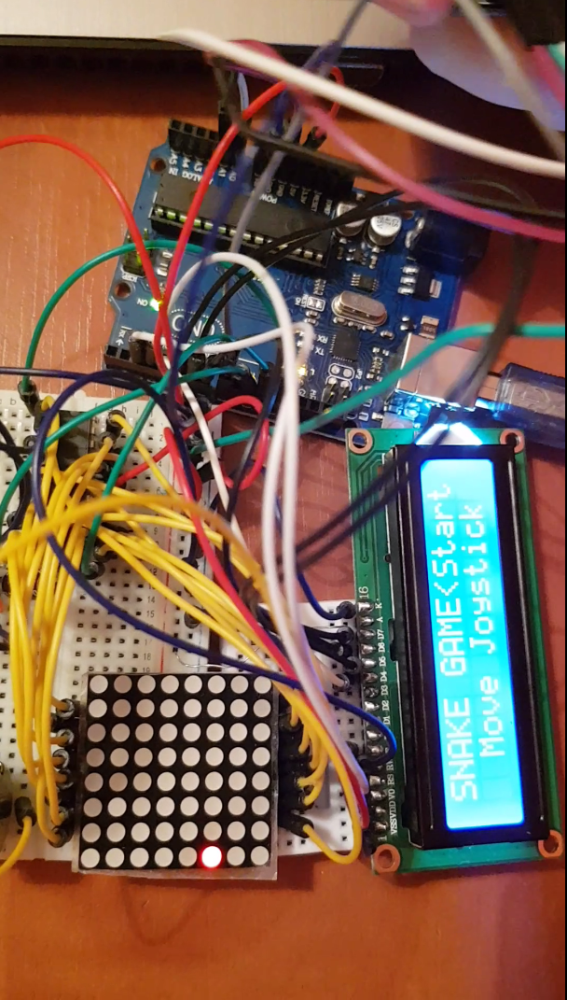

# Snake
 
link video  : https://youtu.be/--T5gEa5le0

 **Components:** 
 - 8x8 LED MATRIX DISPLAY
 - MAX Driver for LED MATRIX
 - 16x2 LCD
 - Joystick
 - Breadboard 
 - Mini breadboard
 - Connectig wires
 - 1 Resistance x 220 Ohm
 - 1 Resistance x 100 Ohm
 
 
 **Description:**
 The game starts when you move the Joystick and on LED Matrix will appear a _snake_. The snake needs to eat the food (the bright spot) to grow. Once the length of the snake increases, you must be carefully because his speed increases too. If the snake meets his tale, the game is over and your score will aprear on LCD, then you can try to play again.
 
**Photo below:**\

